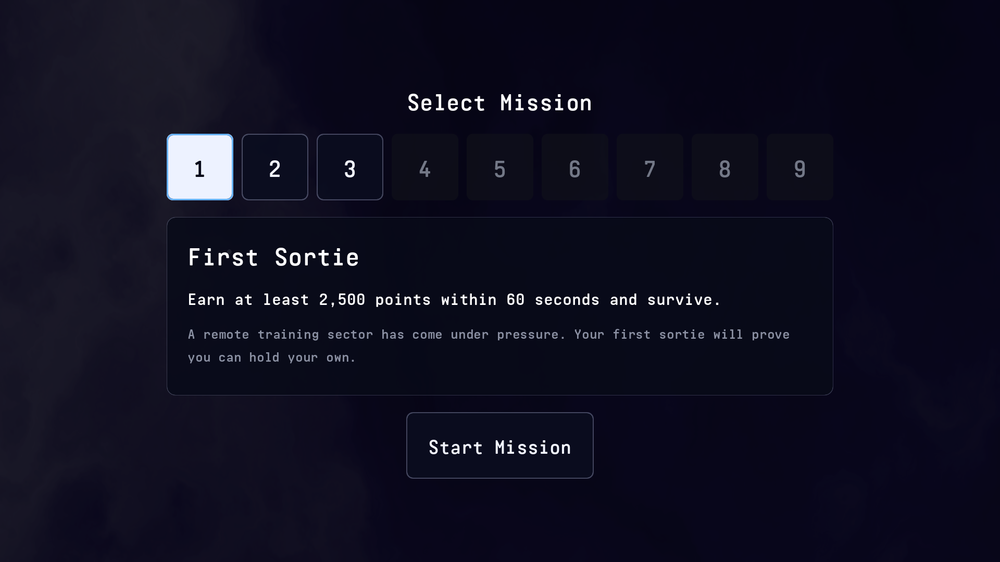

# 选关界面：编辑与验收

构建：`747bad3` + R012 / R013 工作区，2026-09-13，未提交。状态：待手动验收。

标题页点击后进入选关；前三关均复用现有 60 秒、至少 2,500 分且存活的挑战。选关开始进入自由试飞，再点顶部提示开战。4–9 禁用，不加入返回按钮，不保存磁盘进度；本次运行内记住选择。暂停菜单的 Select mission 与结算页的 Touch to select a mission. 都直接回选关，保留上次选择。暂停 Retry 仍重载同关自由试飞。

## 在 Godot 中调整视觉

打开 `res://game/ui/menus/mission_select.tscn`，所有新增 UI 都已经预置。九个按钮和开始按钮来自 `mission_button.tscn`，详情来自 `mission_details.tscn`，背景使用已有场景实例。子场景开启 Editable Children，可在选关场景中覆盖尺寸和样式；修改子场景本身会影响共享实例。

- `SafeArea/Center/Content`：修改内容最小尺寸（初始 1280×760）、VBox 间距与整体布局。
- `MissionButtons`：修改横向间距（初始 16）；按钮最小尺寸初始 128×128，字号 48。按钮的 `mission_id` 元数据与编号对应。
- `MissionDetails/Content`：名称字号 52、目标 34、故事 28；故事采用较低亮度，三个 Label 自动换行。修改 Panel 样式内边距可调整文字位置。
- `StartMission`：初始 360×128，字号 40，位于详情正下方。
- 根节点 `safe_margin`：初始 64，手机在此基础上叠加系统安全区域边距；脚本只更新已有 MarginContainer，不创建 UI。

编辑 `res://game/data/missions/mission_catalog.tres` 的九个 `MissionDefinition`：编号、名称、目标、故事、可用状态。前三关文案已按计划填写。未来调整真实挑战时间/目标分时，需要同时更新目标说明并运行目标一致性检查；本轮资料不控制真实战斗参数。

## 接口与输入

`GameStatusServer.set_selected_mission(id)` 验证资料存在且可用；`get_selected_mission()` 返回当前资料；`selected_mission_id` 只读。战斗加载时捕获编号，结果快照增加 `mission_id`，重置成绩不清除选择。

鼠标走原生 Button 点击；触摸在 `_input` 中显式消费，按下和释放在同一可用按钮内才执行，取消触摸不触发。键盘/手柄沿用 UI 动作，左右遍历可用关卡，下移到开始，上移回所选关卡，确认关卡不开始；确认开始只接受一次。切换延迟执行，失败恢复操作并输出错误。

## 自动检查

匹配引擎：Godot 4.7 / LimboAI 1.8。运行：

```sh
godot --headless --path . res://tests/integration/test_mission_select.tscn
godot --headless --path . res://tests/integration/test_battle_flow.tscn
godot --headless --path . res://tests/integration/test_debug_panel.tscn
godot --headless --path . res://tests/integration/test_virtual_joystick_migration.tscn
godot --headless --path . res://tests/integration/test_touch_hud_layer.tscn
```

最终检查：选关 84 项、战斗 105 项、调试 79 项通过，失败 0、退出码 0；摇杆与 HUD 通过。静态检查新增生产脚本没有 `new()` / `instantiate()` / `add_child()`，场景节点数量在反复选关后稳定。选关覆盖标题动画门控、触摸不穿透、锁定拒绝、鼠标/触摸/焦点确认、重复请求、无可用资料、选择回退、前三关实际开战/结算/重试/返回和文案与参数一致。

图形捕获：`godot --path . res://tests/integration/test_mission_select.tscn -- --capture`。三个关卡截图已检查文字层级、完整按钮与换行，退出码 0；截图位于 `/private/tmp/r012-select-1.png` 至 `r012-select-3.png`。这是渲染检查，不能替代真人操作或手机安全区域检查。

日志：`/private/tmp/r012-final2-selection-output.log`、`r012-test_battle_flow-output.log`、`r012-test_debug_panel-output.log`、`r012-test_virtual_joystick_migration-output.log`、`r012-test_touch_hud_layer-output.log`、`r012-final2-capture-output.log`。导入/测试仍有平台证书读取、沙箱全局编辑器设置保存受限及退出纹理/资源回收提示；无游戏脚本错误。场景切换失败恢复分支未主动破坏资产注入，代码已静态检查。

## 手动验收（均未验收）

先电脑，再实际 iPhone；物理手柄也需单独验收。

| 用例 | 操作 | 预期 |
| --- | --- | --- |
| S01 | 标题动画后点击屏幕 | 只进入选关，没有对局或点击穿透 |
| S02 | 点击 1、2、3，再点击 4–9 与空白 | 资料与高亮对应，锁定与空白不执行操作 |
| S03 | 使用方向与确认，长按确认 | 焦点跳过锁定；确认编号只选关，确认开始只进入一次 |
| S04 | 手机在开始外按下、移入再释放；反向操作与中途取消 | 均不开始，正常完整点击才开始 |
| S05 | 各关开始，试飞 15 秒，再点顶部提示 | 试飞可操作无敌机/计时，正式开始资源重置、刷怪计时启动 |
| S06 | 暂停点击 Select mission；结算动画后点击屏幕 | 两者直接回选关并保留选择，倍率立即恢复 1，选关开始后重新进入自由试飞 |
| S07 | iPhone 横屏检查刘海、圆角和文字 | 九个按钮、详情、开始完整位于安全区域，故事较小且可读 |

记录格式：构建／设备／系统／用例／通过或失败／复现步骤。不能检查则写“未验收”。本轮仅提前实现选关入口，不代表 P4 三种任务规则或 P5 存档已完成。

旧流程截图工具也已更新入口并运行，日志 `/private/tmp/r012-final-flow-capture-output.log`，保留试飞/战斗/暂停/结算截图。



截图辅助的初次图形运行中，模拟鼠标未激活开始，随后出现测试脚本空引用，已中断并修复。截图准备现在调用统一开始入口并核对场景；此项不冒充真人鼠标测试。原日志 `/private/tmp/r012-flow-capture-output.log` 保留。

## R013：暂停与结算返回选关（2026-09-13）

状态：自动验证通过，待手动验收，未提交。替代 R012 的暂停返回标题与结算直接重试入口。

管理器新增 `return_to_mission_select()`，两个 UI 入口共用导航清理；原 `return_to_menu()` 保留兼容并转发到选关。结算只在动画结束后接受新按下事件，首次请求后关闭响应。文字仍在场景中配置，已扩大居中区域并检查渲染，没有动态生成新 UI。

当前回归：选关 87 项、战斗 103 项、调试 79 项、摇杆 36 项及 HUD 检查全部通过，退出码均为 0。前三关覆盖结算触屏回选关、暂停实际按钮点击、选择保留、再次开始及速度恢复。战斗回归包含慢动作中途导航、旧回调取消、音效与输入清理。图形截图检查结算提示完整居中；图形退出码 0，无脚本错误，但仍有退出时纹理 RID 回收提示。Headless 有既有平台证书读取提示。

日志：`/private/tmp/r013-{mission_select,battle_flow,debug_panel,virtual_joystick_migration,touch_hud_layer}-output.log`，图形日志 `/private/tmp/r013-capture-output.log`，结算截图 `/private/tmp/dogfight-result.png`。真人电脑/iPhone 操作、实际听感及安全区域均未验收。手动按 S06 检查成功、失败和暂停三个返回入口，再选择不同关卡开始。
